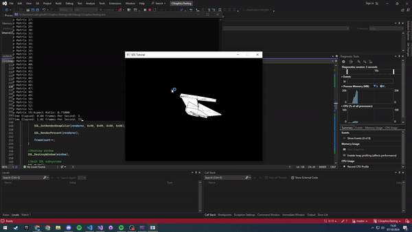

# CGraphicsTesting

WIP repo to try and learn how to make a basic 3D graphics engine in C adapting and learning from this c++ based tutorial series: [https://www.youtube.com/watch?v=ih20l3pJoeU](https://www.youtube.com/watch?v=ih20l3pJoeU)

## Using the Project

Follow the steps below to setup and run the project. The project is restricted to windows at the moment as the build process uses gcc with the windows version of SDL. All commands should be run in the terminal.

### Step 1 | Clone The Repo

```
git clone https://github.com/Surfytom/CGraphicsTesting.git
```

### Step 2 | Run The Makefile

In the cloned repositories base directory run:

```
make
```

### Step 3 | Run Executable

In the cloned repositories base directory run:

```
./main
```

You should now see a spinning spaceship loaded from ObjFiles/VideoShip.obj

## Current Progress

- General Mesh struct has been made which contains lists of triangles to render
- Projection, rotation, translation and scaling vectors are functioning
- Basic OBJ files can be loaded as shown in .gif below


